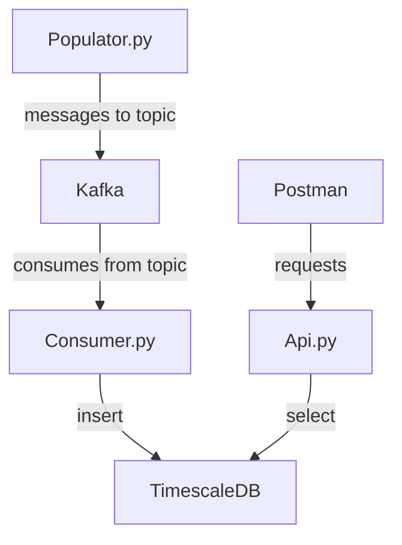

# SIM Card Usage Coding Challenge

> **Disclaimer** : this repository is a solution for a code challenge where the requirements are on the folder **docs**. Only a demo release is available.

## Introduction

### Objectives:

1. The main objective of this project, is of course, develop a solution that meets the challenge requirements;
2. The secondary objective is to design a solution that uses frameworks/databases/packages as unknown as possible at the starting point (so the development time with decent ROI);

### Development Tools:
 - Visual Studio Code (Remote WSL extension)
 - Docker Desktop with WSL 2 backend (Ubuntu 20.04)
 - [Postman](https://www.postman.com/)

### Notes
- No unit testing were scheduled to add to Consumer service due to low development time availability.
- Api service has endpoints unit testing since they were implemented using TDD methodology but the database access is also lacking unit testing in order to keep the development time as short as possible.
- A bug is still present running the unit tests (it will be fixed as soon as possible) that also reflects on the [automated tests](https://github.com/pdrivom/TruphoneCodingChallenge/actions).
- The [automated tests](https://github.com/pdrivom/TruphoneCodingChallenge/actions) are not pushing the image to Docker Hub due to that bug, it will be as soon as the bug gets fixed.
-  Api security token was disable in order to ease the manual testing (no need to add token on header)

 ## How to Run

 On a Linux machine or WSL with **Docker installed**, navigate to a proper folder  than run the command below:

    wget https://raw.githubusercontent.com/pdrivom/TruphoneCodingChallenge/main/release/docker-compose.yml

After downloading the file, just run the command (on the same folder):

    docker-compose up

**Wait for all containers to reach *Running* status.** It can take same time to all containers get to *Running* status since all the images have to be pulled from Docker Hub and the fact that the services depend on each other and **healthchecks** were implemented to ensure they will start in a correct sequence.

In order to manual test the **API**, 3 different endpoints are implemented and this examples can be tested:

- GET Inventory: `http://localhost:8000/api/v1/inventory`
- GET total usage for a single SIM card over an interval of time: `http://localhost:8000/api/v1/simcard/89440001/usage?start=2020-02-01&end=2020-02-02&every=1day&page=1&size=15`
- GET total usage for all SIM cards under a given organization over an interval of time:`http://localhost:8000/api/v1/organization/x00g8/usage?start=2020-02-01&end=2020-02-02&every=1hour&page=1&size=15`

> **This API can be tested using Postman or a Web Browser.**

> URL structure: /api/v1/entity/subentity/id_parameter?query_parameters

As shown in the REST Url's, pagination, granularity and time interval are implemented with time interval and granularity (parameter: every) as mandatory.

> API documentation can be found on: `http://localhost:8000/docs`

## How it works

### Architecture

As the diagram shows, the biggest take on this solution is a clear division from Kafka Consumer and the API. This architecture makes sense because makes easier the scale of each service individually.

## Database Schema

  ##### inventory table:
| sim_card_id | org_id |
|--|--|
| string (PK) |string  |

 ##### usage table:
| date| bytes_used|sim_card_id|
|--|--|--|
| datetime (PK)|int|string (FK)|

The schema is very simple, two tables **inventory** and **usage**. It could also be only one table (**usage** being populated by Kafka producer) and get the inventory from in memory dictionary simulating an second data-source.

## Why this stack?

### Database

Although in this case a SQL database is not a first peek, majorly because it would not be needed any complex relations and it could be assumed that the sim cards inventory were on a different data-source. Nevertheless it was chosen the [TimescaleDB](https://www.timescale.com/)  primarily to get to know the biggest diferences to ***Postgres*** (since this is a  Postgres for time-series) and a NoSQL Timeseries database like ***Riak TS*** and ***InfluxDB*** are already known.

Some big advantage identified to use **TimescaleDB**:
- Easy to add realation between records if needed in the future,
- Timeseries tables and regular tables all-in-one place,
- Grafana Datasource,
- [Distributed Hypertables](https://docs.timescale.com/api/latest/distributed-hypertables/#distributed-hypertables),
- [Partitioning in hypertables with chunks](https://docs.timescale.com/timescaledb/latest/overview/core-concepts/hypertables-and-chunks/#partitioning-in-hypertables-with-chunks),
- Possibility to create regular Views and [Materialized Views](https://docs.timescale.com/api/latest/continuous-aggregates/create_materialized_view/) .

Some cons identified in using **TimescaleDB**:

- SqlAlquemy has no proper way to query time_buckets,
- Inserts in batches are quite challenging, needing extra packages
- The best and easy way to run SQL statements is using plane text witch gets the code a bit messy.

### API

Regarding API's, for this *challenge* requirements would make total sense to use the  web standards REST (HTTP protocol) since it's needed simple GET requests. So, no need for GraphQL or gRPC.

When picking Programming languages and frameworks the most straight forward options are NodeJS with Express/Nest or Python Flask/FastAPI.

In order to keep the secondary objective of the project and keep the Kafka Consumer and the API in the same programing language so they can share modules across containers, the **FastAPI** option was the winner.

Some big advantage identified to use **FastAPI **:
- High performance,
- API documentation is automatic but not very detailed,
- Pagination very fast to implement with external package,
- Concurrency can be easily supported,
- Inbuilt data validation.

Some cons identified in using **FastAPI**:
- Lack of inbuilt security system,
- Small community of developers,
- Lack of proper examples

## How to make production ready

 Improvements required to take the solution to production:
- Endpoints exposed in HTTPS
- Add security token validation to  API Requests
- Add unit testing to Consumer service
- Add database tests (ex: Mock DB)

## Developer's notes

Some useful commands to run when in development:

- Run Consumer: `docker-compose -f docker-compose.yml run --rm consumer sh -c "python consumer.py"`

- Run API: `docker-compose -f docker-compose.yml run --rm --service-ports api sh -c "uvicorn api:app --host 0.0.0.0 --port 8000 --reload"`

- Run API Tests: `docker-compose -f docker-compose.yml run --rm api sh -c "pytest"`

## Future of the repository

Despite the fact that the existence of this repository is due to the need of development of this code challenge it will live on.
The next objective is to implement the same architecture with different technologies.

But firstly some bug fixing and improvements will be targeted, like:
- Add flake8 for linting,
- Add Consumer and Database tests,
- Find/develop proper SQL statement builder since SqlAlchemy does not make a very good job in TimescaleDB.

Future Updates:
- Add a NodeJS(Koa/Loopback) to implement the API in order to make clear compare between the two technologies,
- Add a NoSql Timeseries Database to make clear compare between the two in this use case.

### Further Reading
- https://www.timescale.com/blog/time-series-data-why-and-how-to-use-a-relational-database-instead-of-nosql-d0cd6975e87c/

- https://www.influxdata.com/from-sql-to-nosql/